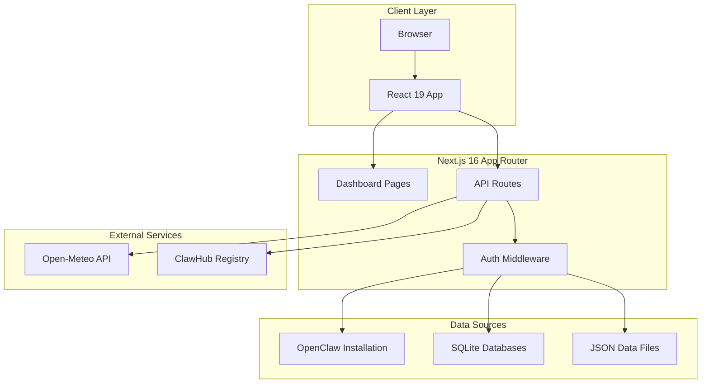
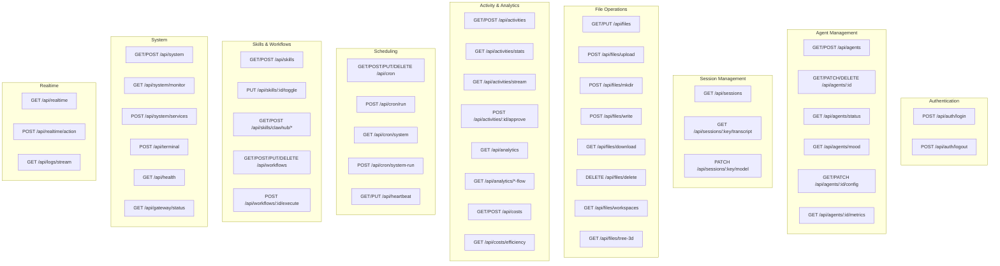
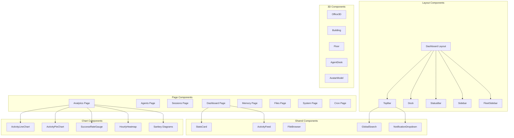
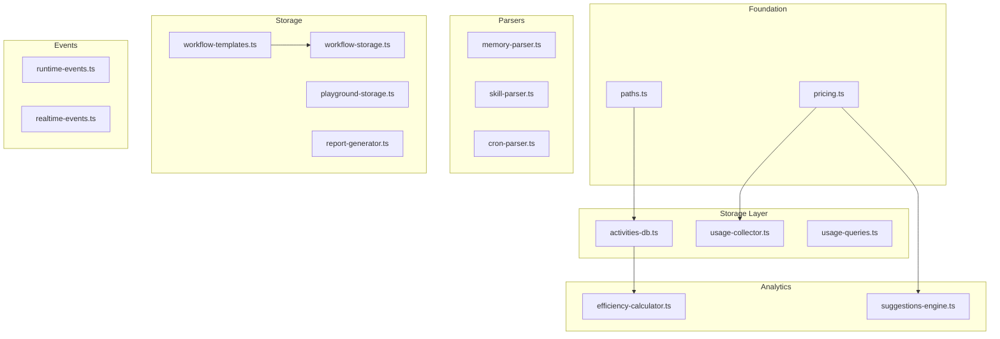
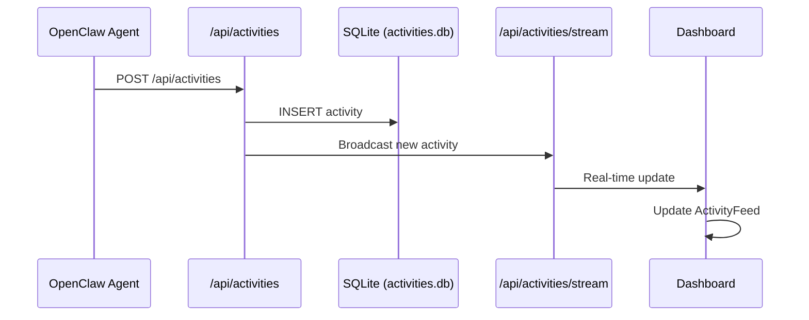
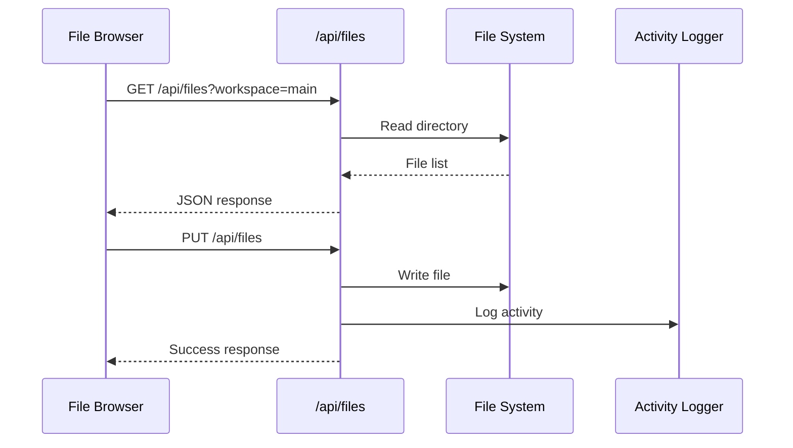
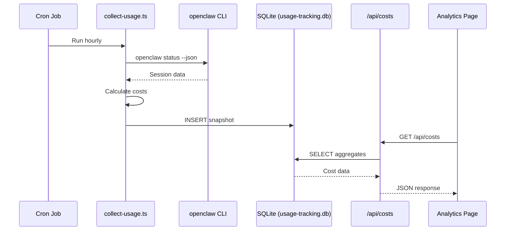
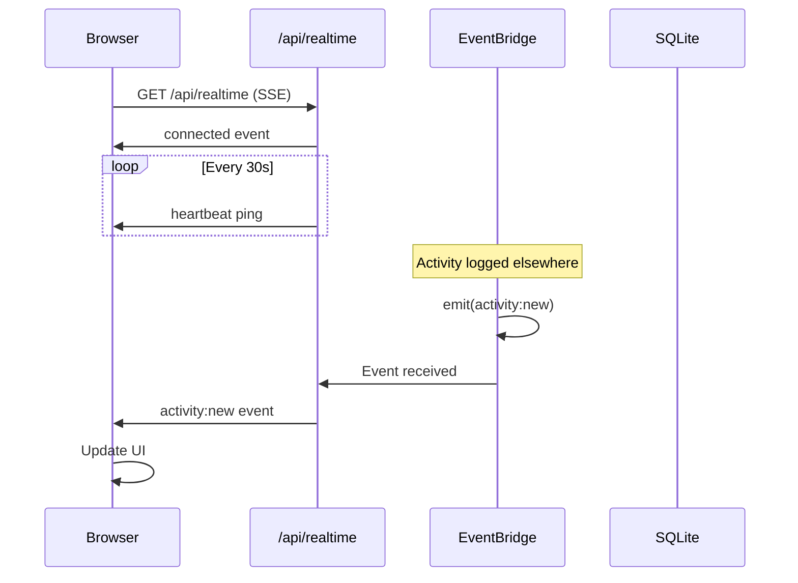
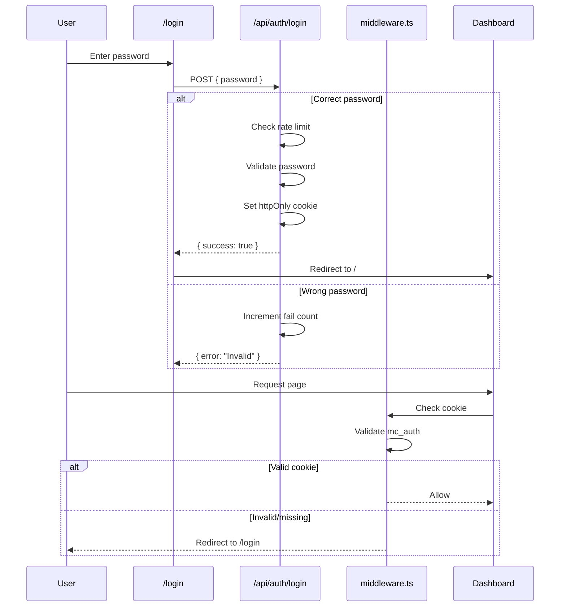

# SuperBotijo — Architecture Documentation

> Complete technical reference for the SuperBotijo dashboard architecture.

---

## Table of Contents

1. [System Overview](#system-overview)
2. [Project Structure](#project-structure)
3. [Dashboard Pages](#dashboard-pages)
4. [API Reference](#api-reference)
5. [Component Library](#component-library)
6. [Utility Modules](#utility-modules)
7. [Hooks](#hooks)
8. [Data Flow Diagrams](#data-flow-diagrams)
9. [Database Schema](#database-schema)
10. [Security Model](#security-model)

---

## System Overview

SuperBotijo is a real-time dashboard for OpenClaw AI agent instances. It reads directly from the OpenClaw installation without requiring a separate database backend.

### High-Level Architecture



### Tech Stack

| Layer | Technology |
|-------|------------|
| Framework | Next.js 16 (App Router) |
| UI | React 19 + Tailwind CSS v4 |
| 3D Graphics | React Three Fiber + Drei + Rapier |
| Charts | Recharts |
| Graphs | @xyflow/react (React Flow) |
| Icons | Lucide React |
| Database | SQLite (better-sqlite3) |
| Runtime | Node.js 18+ (tested with v22) |

---

## Project Structure

```
superbotijo/
├── src/
│   ├── app/
│   │   ├── (dashboard)/          # Protected dashboard pages (21 pages)
│   │   │   ├── page.tsx          # Main dashboard (/)
│   │   │   ├── agents/           # Multi-agent overview
│   │   │   ├── sessions/         # Session history
│   │   │   ├── analytics/        # Charts & cost tracking
│   │   │   ├── activity/         # Activity log
│   │   │   ├── memory/           # Knowledge base editor
│   │   │   ├── files/            # File browser (2D/3D)
│   │   │   ├── system/           # System monitor
│   │   │   ├── cron/             # Cron job manager
│   │   │   ├── subagents/        # Sub-agent monitoring
│   │   │   ├── workflows/        # Workflow designer
│   │   │   ├── playground/       # Model comparison
│   │   │   ├── reports/          # Generated reports
│   │   │   ├── skills/           # Skills manager
│   │   │   ├── notifications/    # Outbox log
│   │   │   ├── terminal/         # Browser terminal
│   │   │   ├── settings/         # Configuration
│   │   │   ├── git/              # Git dashboard
│   │   │   ├── logs/             # Log streaming
│   │   │   ├── calendar/         # Weekly calendar
│   │   │   └── about/            # Agent profile
│   │   ├── api/                  # API routes (~90 endpoints)
│   │   │   ├── auth/             # Authentication
│   │   │   ├── agents/           # Agent management
│   │   │   ├── sessions/         # Session data
│   │   │   ├── files/            # File operations
│   │   │   ├── costs/            # Cost tracking
│   │   │   ├── activities/       # Activity logging
│   │   │   ├── analytics/        # Analytics data
│   │   │   ├── cron/             # Cron management
│   │   │   ├── skills/           # Skills management
│   │   │   ├── memory/           # Memory operations
│   │   │   ├── subagents/        # Sub-agent tracking
│   │   │   ├── workflows/        # Workflow management
│   │   │   ├── playground/       # Model playground
│   │   │   ├── reports/          # Report generation
│   │   │   ├── terminal/         # Terminal commands
│   │   │   ├── system/           # System monitoring
│   │   │   ├── weather/          # Weather data
│   │   │   ├── notifications/    # Notifications
│   │   │   ├── integrations/     # External integrations
│   │   │   ├── suggestions/      # Smart suggestions
│   │   │   ├── browse/           # File browsing
│   │   │   ├── search/           # Global search
│   │   │   ├── knowledge-graph/  # Knowledge graph
│   │   │   ├── realtime/         # Realtime events (SSE)
│   │   │   ├── config/           # Config management
│   │   │   ├── gateway/          # Gateway status
│   │   │   ├── git/              # Git operations
│   │   │   ├── logs/             # Log streaming
│   │   │   ├── media/            # Media serving
│   │   │   └── office/           # 3D office data
│   │   ├── login/                # Login page
│   │   ├── office/               # 3D office (unprotected)
│   │   └── reports/[token]/      # Shared reports (public)
│   │
│   ├── components/               # React components (~100)
│   │   ├── SuperBotijo/          # OS-style UI shell (8)
│   │   ├── Office3D/             # 3D office scene (~25)
│   │   ├── office/               # 2D office variants (7)
│   │   ├── charts/               # Chart components (4)
│   │   ├── sankey/               # Sankey diagrams (4)
│   │   ├── workflow/             # Workflow designer (1)
│   │   ├── files-3d/             # 3D file tree (1)
│   │   └── *.tsx                 # Root components (~50)
│   │
│   ├── config/
│   │   └── branding.ts           # Branding constants (env vars)
│   │
│   ├── hooks/                    # Custom React hooks (6)
│   │   ├── useEventBridge.ts     # Event subscription hooks
│   │   ├── useDebounce.ts        # Debounce utility
│   │   ├── useFleetSidebar.ts    # Sidebar state
│   │   ├── useRealtime.ts        # SSE connection
│   │   ├── useActivityStream.ts  # Activity streaming
│   │   └── useGatewayStatus.ts   # Gateway polling
│   │
│   ├── i18n/                     # Internationalization
│   │   ├── provider.tsx          # I18nProvider + useI18n
│   │   └── messages/
│   │       ├── en.json           # English translations
│   │       └── es.json           # Spanish translations
│   │
│   ├── lib/                      # Utility modules (22)
│   │   ├── pricing.ts            # Cost calculations
│   │   ├── kanban-db.ts          # Kanban board storage (SQLite)
│   │   ├── openclaw-agents.ts    # OpenClaw agent detection
│   │   ├── activity-logger.ts    # Activity logging (legacy)
│   │   ├── activities-db.ts      # SQLite activity storage
│   │   ├── usage-collector.ts    # Usage data collection
│   │   ├── usage-queries.ts      # Usage queries
│   │   ├── efficiency-calculator.ts # Efficiency metrics
│   │   ├── memory-parser.ts      # Knowledge graph extraction
│   │   ├── skill-parser.ts       # Skill file parsing
│   │   ├── skills-installer.ts   # Skill installation
│   │   ├── agent-skills.ts       # Agent skill mapping
│   │   ├── cron-parser.ts        # Cron expression parsing
│   │   ├── workflow-storage.ts   # Workflow persistence
│   │   ├── workflow-templates.ts # Workflow definitions
│   │   ├── playground-storage.ts # Experiment storage
│   │   ├── report-generator.ts   # Report generation
│   │   ├── suggestions-engine.ts # Smart suggestions
│   │   ├── communication-aggregator.ts # Agent communication
│   │   ├── paths.ts              # Path utilities
│   │   ├── runtime-events.ts     # Event bridge
│   │   └── realtime-events.ts    # Realtime event types
│   │
│   └── middleware.ts             # Auth guard for all routes
│
├── data/                         # Data files (gitignored)
│   ├── activities.json           # Activity log (legacy)
│   ├── cron-jobs.json            # Cron job definitions
│   ├── notifications.json        # Notification store
│   ├── configured-skills.json    # Skills configuration
│   ├── tasks.json                # Task definitions
│   ├── workflows.json            # Workflow definitions
│   ├── experiments.json          # Playground experiments
│   ├── generated-reports.json    # Generated reports
│   ├── kanban.db                 # SQLite Kanban board (tasks, columns, projects)
│   ├── activities.db             # SQLite activities
│   └── usage-tracking.db         # SQLite usage tracking
│
├── scripts/                      # Setup and collection scripts
│   ├── collect-usage.ts          # Usage data collection
│   └── setup-cron.sh             # Cron setup script
│
├── public/
│   └── models/                   # GLB avatar models
│
├── docs/                         # Extended documentation
│   └── COST-TRACKING.md          # Cost tracking guide
│
├── .env.example                  # Environment template
├── AGENTS.md                     # AI agent instructions
├── ARCHITECTURE.md               # This file
└── README.md                     # Project overview
```

---

## Dashboard Pages

### Page Overview Diagram

```mermaid
graph LR
    subgraph "Core Monitoring"
        Dashboard[Dashboard /]
        Agents[Agents /agents]
        Sessions[Sessions /sessions]
        Activity[Activity /activity]
    end
    
    subgraph "Data Management"
        Memory[Memory /memory]
        Files[Files /files]
        Search[Search /search]
    end
    
    subgraph "Analytics"
        Analytics[Analytics /analytics]
        Reports[Reports /reports]
        Suggestions[Suggestions /suggestions]
    end
    
    subgraph "Agent Intelligence"
        Subagents[Subagents /subagents]
        Workflows[Workflows /workflows]
        Playground[Playground /playground]
    end
    
    subgraph "System"
        System[System /system]
        Cron[Cron /cron]
        Terminal[Terminal /terminal]
        Logs[Logs /logs]
        Git[Git /git]
    end
    
    subgraph "Configuration"
        Settings[Settings /settings]
        Skills[Skills /skills]
        Notifications[Notifications /notifications]
    end
    
    subgraph "Other"
        Calendar[Calendar /calendar]
        About[About /about]
        Office[Office 3D /office]
    end
```

### Detailed Page Reference

| Route | Page | Purpose | Primary APIs | Key Features |
|-------|------|---------|--------------|--------------|
| `/` | Dashboard | Overview & quick access | `/api/activities/stats`, `/api/agents` | Stats cards, activity feed, weather, mood, suggestions |
| `/agents` | Agents | Multi-agent system | `/api/agents`, `/api/subagents/communications` | Cards, hierarchy, communication graph |
| `/sessions` | Sessions | Session history | `/api/sessions` | Filter by type, search, transcript viewer |
| `/analytics` | Analytics | Charts & costs | `/api/analytics`, `/api/costs` | Daily trends, Sankey diagrams, cost breakdown |
| `/activity` | Activity | Activity log | `/api/activities` | Heatmap, filters, CSV export, approvals |
| `/memory` | Memory | Knowledge base | `/api/files`, `/api/knowledge-graph` | Editor, graph visualization, word cloud |
| `/files` | Files | File browser | `/api/files`, `/api/files/tree-3d` | 2D/3D view, workspace selector |
| `/system` | System | Hardware monitor | `/api/system/monitor`, `/api/system/services` | CPU/RAM/Disk/Network, service management |
| `/cron` | Cron | Job scheduler | `/api/cron`, `/api/cron/system`, `/api/heartbeat` | OpenClaw + system crons, timeline |
| `/subagents` | Subagents | Sub-agent monitor | `/api/subagents` | Real-time status, timeline, metrics |
| `/workflows` | Workflows | Workflow designer | `/api/workflows` | Visual node editor, templates |
| `/playground` | Playground | Model comparison | `/api/playground/compare`, `/api/playground/experiments` | Side-by-side testing, save experiments |
| `/reports` | Reports | Generated reports | `/api/reports` | Preview, PDF export, share links |
| `/skills` | Skills | Skills manager | `/api/skills`, `/api/skills/clawhub/*` | Enable/disable, ClawHub browser |
| `/notifications` | Notifications | Outbox log | `/api/notifications/outbox` | Message history, filters |
| `/terminal` | Terminal | Browser terminal | `/api/terminal` | Command allowlist, history |
| `/settings` | Settings | Configuration | `/api/system`, `/api/config` | System info, integrations, config editor |
| `/git` | Git | Repository dashboard | `/api/git` | Branch status, actions (status/log/diff/pull) |
| `/logs` | Logs | Log streaming | `/api/logs/stream` | SSE real-time, syntax highlighting |
| `/calendar` | Calendar | Weekly view | - | Cron job schedule |
| `/about` | About | Agent profile | `/api/activities`, `/api/skills` | Stats, capabilities, philosophy |
| `/office` | Office 3D | 3D visualization | `/api/office` | Multi-floor building, avatars |

---

## API Reference

### API Categories Diagram



### Complete API Endpoint List

#### Authentication (`/api/auth/*`)

| Method | Endpoint | Description |
|--------|----------|-------------|
| POST | `/api/auth/login` | Authenticate with password (rate-limited) |
| POST | `/api/auth/logout` | Clear auth cookie |

#### Agents (`/api/agents/*`)

| Method | Endpoint | Description |
|--------|----------|-------------|
| GET | `/api/agents` | List all agents |
| POST | `/api/agents` | Create new agent |
| GET | `/api/agents/status` | Get status for all agents |
| GET | `/api/agents/mood` | Get agent mood score |
| GET | `/api/agents/[id]` | Get agent by ID |
| PATCH | `/api/agents/[id]` | Pause/resume agent |
| DELETE | `/api/agents/[id]` | Delete agent |
| GET | `/api/agents/[id]/config` | Get agent config |
| PATCH | `/api/agents/[id]/config` | Update agent config |
| GET | `/api/agents/[id]/status` | Get detailed status |
| GET | `/api/agents/[id]/metrics` | Get agent metrics |
| GET | `/api/agents/subagents` | Get active sub-agents |

#### Sessions (`/api/sessions/*`)

| Method | Endpoint | Description |
|--------|----------|-------------|
| GET | `/api/sessions` | List all sessions |
| GET | `/api/sessions/[key]/transcript` | Get session messages |
| PATCH | `/api/sessions/[key]/model` | Change session model |

#### Files (`/api/files/*`)

| Method | Endpoint | Description |
|--------|----------|-------------|
| GET | `/api/files` | List/read files |
| PUT | `/api/files` | Save file content |
| POST | `/api/files/upload` | Upload files |
| POST | `/api/files/mkdir` | Create directory |
| POST | `/api/files/write` | Write file content |
| GET | `/api/files/download` | Download file |
| DELETE | `/api/files/delete` | Delete file/folder |
| GET | `/api/files/workspaces` | List workspaces |
| GET | `/api/files/tree-3d` | Get 3D file tree |

#### Activities (`/api/activities/*`)

| Method | Endpoint | Description |
|--------|----------|-------------|
| GET | `/api/activities` | List activities (with filters) |
| POST | `/api/activities` | Create activity |
| GET | `/api/activities/stats` | Get statistics |
| GET | `/api/activities/stream` | SSE activity stream |
| POST | `/api/activities/[id]/approve` | Approve/reject activity |

#### Analytics (`/api/analytics/*`)

| Method | Endpoint | Description |
|--------|----------|-------------|
| GET | `/api/analytics` | Get analytics data |
| GET | `/api/analytics/token-flow` | Token flow Sankey |
| GET | `/api/analytics/task-flow` | Task flow Sankey |
| GET | `/api/analytics/time-flow` | Time flow Sankey |

#### Costs (`/api/costs/*`)

| Method | Endpoint | Description |
|--------|----------|-------------|
| GET | `/api/costs` | Get cost summary |
| POST | `/api/costs` | Update budget |
| GET | `/api/costs/efficiency` | Get efficiency score |
| GET | `/api/costs/top-tasks` | Get top tasks |

#### Cron (`/api/cron/*`)

| Method | Endpoint | Description |
|--------|----------|-------------|
| GET | `/api/cron` | List OpenClaw cron jobs |
| POST | `/api/cron` | Create job |
| PUT | `/api/cron` | Update job |
| DELETE | `/api/cron` | Delete job |
| POST | `/api/cron/run` | Trigger job manually |
| GET | `/api/cron/runs` | Get run history |
| GET | `/api/cron/system` | Get system cron jobs |
| POST | `/api/cron/system-run` | Run system job |
| GET | `/api/cron/system-logs` | Get system job logs |

#### Tasks (`/api/tasks`)

| Method | Endpoint | Description |
|--------|----------|-------------|
| GET | `/api/tasks` | Unified tasks API (cron + heartbeat + scheduled) |

#### OpenClaw Agents (`/api/openclaw/agents`)

| Method | Endpoint | Description |
|--------|----------|-------------|
| GET | `/api/openclaw/agents` | List agents from openclaw.json |
| POST | `/api/openclaw/agents` | Sync agents to Kanban projects |

#### Skills (`/api/skills/*`)

| Method | Endpoint | Description |
|--------|----------|-------------|
| GET | `/api/skills` | List all skills |
| POST | `/api/skills` | Install/uninstall/update skill |
| GET | `/api/skills/updates` | Check for updates |
| PUT | `/api/skills/[id]/toggle` | Enable/disable skill |
| POST | `/api/skills/[id]/update` | Update skill version |
| GET | `/api/skills/clawhub/search` | Search ClawHub |
| POST | `/api/skills/clawhub/install` | Install from ClawHub |

#### Memory (`/api/memory/*`, `/api/memories/*`)

| Method | Endpoint | Description |
|--------|----------|-------------|
| GET | `/api/memory/search` | Search memory files |
| GET | `/api/memories/word-cloud` | Get word cloud data |

#### Knowledge Graph

| Method | Endpoint | Description |
|--------|----------|-------------|
| GET | `/api/knowledge-graph` | Get entity relationships |

#### Subagents (`/api/subagents/*`)

| Method | Endpoint | Description |
|--------|----------|-------------|
| GET | `/api/subagents` | Get sub-agent data |
| GET | `/api/subagents/communications` | Get communication graph |

#### Workflows (`/api/workflows/*`)

| Method | Endpoint | Description |
|--------|----------|-------------|
| GET | `/api/workflows` | List workflows |
| POST | `/api/workflows` | Create workflow |
| PUT | `/api/workflows` | Update workflow |
| DELETE | `/api/workflows` | Delete workflow |
| POST | `/api/workflows/[id]/execute` | Execute workflow |

#### Playground (`/api/playground/*`)

| Method | Endpoint | Description |
|--------|----------|-------------|
| GET | `/api/playground/compare` | Get available models |
| POST | `/api/playground/compare` | Compare model responses |
| GET | `/api/playground/experiments` | List experiments |
| POST | `/api/playground/experiments` | Save experiment |
| DELETE | `/api/playground/experiments` | Delete experiment |

#### Reports (`/api/reports/*`)

| Method | Endpoint | Description |
|--------|----------|-------------|
| GET | `/api/reports` | List report files |
| GET | `/api/reports/generated` | List generated reports |
| POST | `/api/reports/generated` | Generate report |
| DELETE | `/api/reports/generated` | Delete report |
| GET | `/api/reports/[id]/pdf` | Export as HTML/PDF |
| POST | `/api/reports/[id]/share` | Generate share link |
| DELETE | `/api/reports/[id]/share` | Revoke share |
| GET | `/api/reports/shared` | List shared reports |

#### Notifications (`/api/notifications/*`)

| Method | Endpoint | Description |
|--------|----------|-------------|
| GET | `/api/notifications` | List notifications |
| POST | `/api/notifications` | Create notification |
| PATCH | `/api/notifications` | Mark as read |
| DELETE | `/api/notifications` | Delete notification(s) |
| GET | `/api/notifications/outbox` | Get outbox messages |

#### System (`/api/system/*`)

| Method | Endpoint | Description |
|--------|----------|-------------|
| GET | `/api/system` | Get system info |
| POST | `/api/system` | System actions |
| GET | `/api/system/stats` | Get resource stats |
| GET | `/api/system/uptime` | Get uptime stats |
| POST | `/api/system/services` | Service actions |
| GET | `/api/system/monitor` | Get detailed monitor data |

#### Other Endpoints

| Method | Endpoint | Description |
|--------|----------|-------------|
| GET | `/api/health` | Health check for all services |
| GET | `/api/weather` | Weather data (Open-Meteo) |
| POST | `/api/terminal` | Execute terminal command |
| GET | `/api/git` | Git repository status |
| POST | `/api/git` | Git actions |
| GET | `/api/logs/stream` | SSE log stream |
| GET | `/api/browse` | Browse files |
| GET | `/api/search` | Global search |
| GET | `/api/realtime` | SSE realtime stream |
| POST | `/api/realtime/action` | Send action to agents |
| GET | `/api/gateway/status` | Gateway status |
| GET | `/api/office` | 3D office data |
| GET | `/api/models` | List available models |
| GET | `/api/actions` | List action types |
| GET | `/api/config` | Get configuration |
| PUT | `/api/config` | Update configuration |
| GET | `/api/config/restore` | Get backup |
| POST | `/api/config/restore` | Restore from backup |
| GET | `/api/integrations/[id]/test` | Test integration |
| GET | `/api/integrations/[id]/last-activity` | Get last activity |
| POST | `/api/integrations/[id]/reauth` | Reauthenticate |
| GET | `/api/suggestions` | Get suggestions |
| POST | `/api/suggestions/[id]/apply` | Apply suggestion |
| POST | `/api/suggestions/[id]/dismiss` | Dismiss suggestion |
| GET | `/api/media/[...path]` | Serve media files |

---

## Component Library

### Component Hierarchy



### Component Categories

#### SuperBotijo/* (OS-style UI Shell)

| Component | Purpose | Props |
|-----------|---------|-------|
| `TopBar` | Main navigation bar | - |
| `Dock` | Left sidebar navigation | - |
| `StatusBar` | Bottom status bar | - |
| `AgentRow` | Agent list row | `emoji`, `name`, `status`, `model` |
| `ActivityRow` | Activity log row | `time`, `agent`, `description` |
| `CronRow` | Cron job row | `name`, `nextRun`, `status` |
| `MetricCard` | Dashboard metric | `icon`, `value`, `label`, `change` |
| `SectionHeader` | Section label | `label` |

#### Office3D/* (React Three Fiber)

| Component | Purpose |
|-----------|---------|
| `Office3D` | Main 3D scene |
| `Building` | Multi-floor building |
| `Floor` | Procedural floor |
| `AgentDesk` | Desk with avatar |
| `AvatarModel` | GLB avatar loader |
| `MovingAvatar` | Animated avatar |
| `VisitorAvatar` | Sub-agent avatar |
| `Walls` | Office walls |
| `Lights` | Scene lighting |
| `Whiteboard` | Interactive board |
| `FileCabinet` | Memory access |
| `CoffeeMachine` | Mood indicator |
| `WallClock` | Real-time clock |
| `FirstPersonControls` | FPS camera |

#### charts/* (Recharts)

| Component | Purpose |
|-----------|---------|
| `ActivityLineChart` | Daily activity bar chart |
| `ActivityPieChart` | Activity type donut |
| `SuccessRateGauge` | Percentage gauge |
| `HourlyHeatmap` | 24x7 activity heatmap |

#### sankey/* (Flow Diagrams)

| Component | Purpose |
|-----------|---------|
| `SankeyDiagram` | Generic Sankey |
| `TokenFlowSankey` | Token distribution |
| `TaskFlowSankey` | Task execution flow |
| `TimeFlowSankey` | Time distribution |

#### workflow/* (React Flow)

| Component | Purpose |
|-----------|---------|
| `WorkflowCanvas` | Visual workflow editor |

---

## Utility Modules

### Module Dependency Graph



### Module Reference

| Module | Purpose | Key Exports |
|--------|---------|-------------|
| `pricing.ts` | AI model cost calculations | `calculateCost()`, `MODEL_PRICING` |
| `kanban-db.ts` | Kanban board storage | `createTask()`, `getTask()`, `listTasks()`, `moveTask()`, `createProject()`, `getColumns()` |
| `openclaw-agents.ts` | OpenClaw agent detection | `getOpenClawAgents()`, `syncAgentsToProjects()` |
| `activities-db.ts` | SQLite activity storage | `logActivity()`, `getActivities()`, `getActivityStats()` |
| `usage-collector.ts` | OpenClaw session collection | `collectUsage()`, `SessionData` |
| `usage-queries.ts` | Usage analytics queries | `getCostSummary()`, `getCostByAgent()` |
| `efficiency-calculator.ts` | Efficiency scoring | `calculateEfficiencyScore()` |
| `memory-parser.ts` | Knowledge graph extraction | `parseMemoryFiles()` |
| `skill-parser.ts` | SKILL.md parsing | `parseSkill()`, `scanAllSkills()` |
| `skills-installer.ts` | Skill installation | `installSkill()`, `uninstallSkill()` |
| `cron-parser.ts` | Cron expression parsing | `cronToHuman()`, `getNextRuns()` |
| `workflow-storage.ts` | Workflow persistence | `loadWorkflows()`, `saveWorkflows()` |
| `suggestions-engine.ts` | Smart suggestions | `generateSuggestions()` |
| `communication-aggregator.ts` | Agent communication | `aggregateCommunications()` |
| `runtime-events.ts` | Event bridge | `eventBridge`, `emitActivityUpdate()` |
| `realtime-events.ts` | SSE event types | `RealtimeEvent`, `CHANNELS` |

---

## Hooks

### Hook Reference

| Hook | Purpose | Returns |
|------|---------|---------|
| `useFleetSidebar` | Fleet sidebar state | `{ isOpen, toggleSidebar }` |
| `useActivityStream` | SSE activity feed | `{ activities, isConnected, error }` |
| `useGatewayStatus` | Gateway polling | `{ status, loading, refresh }` |
| `useDebounce<T>` | Debounced value | `T` |
| `useRealtime` | Full SSE connection | Connection state + methods |
| `useEventSubscription` | Event bridge subscription | `void` |

### Hook Usage

```typescript
// Fleet sidebar toggle
const { isOpen, toggleSidebar } = useFleetSidebar();

// Activity streaming
const { activities, isConnected } = useActivityStream();

// Gateway status polling
const { status, loading } = useGatewayStatus();

// Debounced search
const [query, setQuery] = useState("");
const debouncedQuery = useDebounce(query, 300);
```

---

## Data Flow Diagrams

### Activity Logging Flow



### File Operations Flow



### Cost Tracking Flow



### Realtime Event Flow



---

## Database Schema

### activities.db

```sql
CREATE TABLE activities (
    id TEXT PRIMARY KEY,
    timestamp TEXT NOT NULL,
    type TEXT NOT NULL,
    description TEXT NOT NULL,
    status TEXT NOT NULL,
    duration_ms INTEGER,
    tokens_used INTEGER,
    agent TEXT,
    metadata TEXT,  -- JSON
    created_at TEXT DEFAULT CURRENT_TIMESTAMP
);

CREATE INDEX idx_activities_timestamp ON activities(timestamp);
CREATE INDEX idx_activities_type ON activities(type);
CREATE INDEX idx_activities_status ON activities(status);
CREATE INDEX idx_activities_agent ON activities(agent);
```

### usage-tracking.db

```sql
CREATE TABLE usage_snapshots (
    id INTEGER PRIMARY KEY AUTOINCREMENT,
    timestamp INTEGER NOT NULL,
    date TEXT NOT NULL,
    hour INTEGER NOT NULL,
    agent_id TEXT NOT NULL,
    model TEXT NOT NULL,
    input_tokens INTEGER NOT NULL,
    output_tokens INTEGER NOT NULL,
    total_tokens INTEGER NOT NULL,
    cost REAL NOT NULL
);

CREATE INDEX idx_usage_timestamp ON usage_snapshots(timestamp);
CREATE INDEX idx_usage_date ON usage_snapshots(date);
CREATE INDEX idx_usage_agent ON usage_snapshots(agent_id);
CREATE INDEX idx_usage_model ON usage_snapshots(model);
```

### kanban.db

```sql
CREATE TABLE kanban_tasks (
    id TEXT PRIMARY KEY,
    title TEXT NOT NULL,
    description TEXT,
    status TEXT NOT NULL DEFAULT 'backlog',
    priority TEXT NOT NULL DEFAULT 'medium',
    assignee TEXT,
    labels TEXT,
    "order" REAL NOT NULL DEFAULT 0,
    project_id TEXT,
    due_date TEXT,
    depends_on TEXT,
    execution_status TEXT,
    execution_result TEXT,
    blocked_by TEXT,
    waiting_for TEXT,
    created_at TEXT NOT NULL,
    updated_at TEXT NOT NULL
);

CREATE TABLE kanban_columns (
    id TEXT PRIMARY KEY,
    name TEXT NOT NULL,
    color TEXT NOT NULL DEFAULT '#6b7280',
    "order" REAL NOT NULL DEFAULT 0,
    "limit" INTEGER
);

CREATE TABLE projects (
    id TEXT PRIMARY KEY,
    name TEXT NOT NULL,
    description TEXT,
    mission_alignment TEXT,
    status TEXT NOT NULL DEFAULT 'active',
    milestones TEXT,
    created_at TEXT NOT NULL,
    updated_at TEXT NOT NULL
);

CREATE TABLE agent_identities (
    id TEXT PRIMARY KEY,
    name TEXT NOT NULL,
    role TEXT NOT NULL,
    personality TEXT,
    avatar TEXT,
    mission TEXT,
    created_at TEXT NOT NULL,
    updated_at TEXT NOT NULL
);

CREATE TABLE operations_journal (
    id TEXT PRIMARY KEY,
    date TEXT NOT NULL,
    narrative TEXT NOT NULL,
    highlights TEXT,
    created_at TEXT NOT NULL
);
```

---

## Security Model

### Authentication Flow



### Security Features

| Feature | Implementation |
|---------|----------------|
| **Auth Cookie** | `httpOnly`, `sameSite: lax`, `secure` in production |
| **Rate Limiting** | 5 attempts per 15 min, 15-min lockout per IP |
| **Route Protection** | All routes protected except `/login`, `/api/auth/*`, `/api/health` |
| **Terminal Commands** | Strict allowlist, blocks `rm`, `sudo`, `curl`, `wget`, etc. |
| **File Access** | Path sanitization, blocks traversal attacks |
| **Protected Files** | `MEMORY.md`, `SOUL.md`, `IDENTITY.md` cannot be deleted |

### Public Routes

- `/login` - Login page
- `/api/auth/login` - Authentication endpoint
- `/api/auth/logout` - Logout endpoint
- `/api/health` - Health check (for monitoring)
- `/office` - 3D office (optional, can be protected)
- `/reports/[token]` - Shared reports (token-based)

---

## Environment Variables

| Variable | Required | Description |
|----------|----------|-------------|
| `ADMIN_PASSWORD` | Yes | Dashboard login password |
| `AUTH_SECRET` | Yes | Cookie signing secret |
| `OPENCLAW_DIR` | No | Path to OpenClaw (default: `/root/.openclaw`) |
| `NEXT_PUBLIC_AGENT_NAME` | No | Agent display name |
| `NEXT_PUBLIC_AGENT_EMOJI` | No | Agent emoji |
| `NEXT_PUBLIC_AGENT_DESCRIPTION` | No | Agent description |
| `NEXT_PUBLIC_AGENT_LOCATION` | No | Agent location |
| `NEXT_PUBLIC_BIRTH_DATE` | No | Agent birth date (ISO) |
| `NEXT_PUBLIC_AGENT_AVATAR` | No | Avatar path in `/public` |
| `NEXT_PUBLIC_OWNER_USERNAME` | No | Owner username |
| `NEXT_PUBLIC_OWNER_EMAIL` | No | Owner email |
| `NEXT_PUBLIC_TWITTER_HANDLE` | No | Twitter handle |
| `NEXT_PUBLIC_COMPANY_NAME` | No | Company name |
| `NEXT_PUBLIC_APP_TITLE` | No | Browser tab title |

---

## File: data/ Directory

| File | Purpose |
|------|---------|
| `activities.json` | Legacy activity log (being replaced by SQLite) |
| `cron-jobs.json` | Cron job definitions |
| `notifications.json` | Notification store |
| `configured-skills.json` | Skills configuration |
| `tasks.json` | Task definitions |
| `workflows.json` | Workflow definitions |
| `experiments.json` | Playground experiments |
| `generated-reports.json` | Generated reports with share tokens |
| `disabled-skills.json` | Disabled skill IDs |

---

## Internationalization (i18n)

### Supported Languages

- English (`en`)
- Spanish (`es`)

### Usage

```typescript
import { useI18n } from "@/i18n/provider";

function Component() {
  const { t, locale, setLocale } = useI18n();
  
  return (
    <div>
      <h1>{t("dashboard.title")}</h1>
      <button onClick={() => setLocale("es")}>Español</button>
    </div>
  );
}
```

### Translation Keys Structure

```
common.*      - Generic UI strings
language.*    - Language selector
login.*       - Login page
dock.*        - Dock icons
topbar.*      - Top bar
statusBar.*   - Status bar
dashboard.*   - Dashboard page
fleet.*       - Fleet sidebar
agents.*      - Agents page
cron.*        - Cron jobs page
files.*       - File browser
memory.*      - Memory browser
settings.*    - Settings page
system.*      - System monitor
sessions.*    - Sessions page
```

---

## Scripts

| Script | Purpose |
|--------|---------|
| `scripts/collect-usage.ts` | Collect usage data from OpenClaw |
| `scripts/setup-cron.sh` | Setup hourly usage collection cron |

### Usage Collection

```bash
# Manual collection
npx tsx scripts/collect-usage.ts

# Setup hourly cron
./scripts/setup-cron.sh
```

---

## Contributing

When adding new features:

1. **Pages**: Add to `src/app/(dashboard)/<name>/page.tsx`
2. **APIs**: Add to `src/app/api/<name>/route.ts`
3. **Components**: Add to `src/components/`
4. **Utilities**: Add to `src/lib/`
5. **Hooks**: Add to `src/hooks/`
6. **Translations**: Add keys to both `en.json` and `es.json`

### Code Style

- Use double quotes for strings
- Define interfaces for all object shapes
- Use `"use client";` for client components
- Follow the import order: built-ins → external → internal
- Add `export const dynamic = "force-dynamic";` to API routes

---

*Last updated: 2026-03-02*
